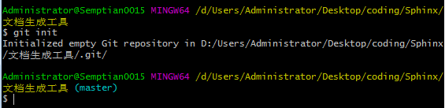

本地仓库搭建
=============

参考文档
---------
- `官方说明文档 <https://git-scm.com/book/zh/v2>`_
- `相关pdf文档 <http://pan.baidu.com/s/1bpzQBV5>`_
- `廖雪峰博客 <http://www.liaoxuefeng.com/wiki/0013739516305929606dd18361248578c67b8067c8c017b000/>`_

git下载安装
------------

- window下载安装
	- `官网下载 <https://git-scm.com/download/win>`_ [国内直接从官网下载比较困难，有时需要翻墙]
	- `github仓库下载 <https://github.com/waylau/git-for-win>`_

- linux下载安装
	- `Download for Linux and Unix <https://git-scm.com/download/linux>`_ 

- Mac下载安装
	- `官网下载 <https://git-scm.com/download/mac>`_

初始化仓库
-----------
window下命令行工具也有很多，比较推荐的是

- Git Bash[安装git后自带的bash环境，支持shell命令]
- `Cmder <http://cmder.net/>`_ [window上的命令行神器]

在这里我们使用 ``git bash``

切换到文档主目录[Makefile文件所在目录]，点击鼠标右键，选择Git Bash Here，使用git自带bash环境，输入 ``git init`` 命令初始化仓库

.. figure:: ../images/1-github/1.png

这时Git就把仓库建好了，而且告诉你是一个空的仓库 ``empty Git repository`` ，可以发现当前目录下多了一个 ``.git`` 的文件夹，这个目录是Git来跟踪管理版本库的，没事千万不要手动修改这个目录里面的文件，否则就把Git仓库给破坏了。如果你没有看到 ``.git`` 文件夹，那是因为这个目录默认是隐藏的，用 ``ls -ah`` 命令就可以看见隐藏的 ``.git`` 文件夹

.. figure:: ../images/1-github/3.png

提交本地仓库
-------------
- 初始化仓库后，我们需要将目录下所有文件进行版本控制，输入 ``git add --all`` 将当前目录下所有文件加入到版本控制中；之后可以使用 ``git status`` 命令查看当前版本控制状态，确认是否将所有文件都添加到版本控制当中

- 确认所有文件都添加到版本控制中后，使用 ``git commit -am "<message>"`` 命令将当前所有版本控制的文件[即上图红框标注的待commit的文件]commit提交到本地git仓库中

.. figure:: ../images/1-github/5.png

- 再使用 ``git status`` 命令查看当前版本控制状态

