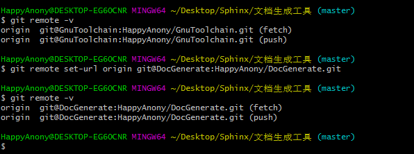

远程仓库部署
=============

参考文档
- `如何解决failed to push some refs to git <https://www.jianshu.com/p/835e0a48c825>`_
- `fatal Could not read from remote repository的解决办法 <http://blog.csdn.net/huahua78/article/details/52330792>`_

配置remote url
----------------
- 使用\ ``git remote  -v``\ 命令查看当前配置的remote仓库
- 点击github仓库页面的\ ``clone and download``\ ;然后点击\ ``Use SSH``\ ，找到ssh的clone地址，复制该地址

.. figure:: ../images/1-github/23.png

- 如果\ ``git remote  -v``\ 命令结果为空，则使用\ ``git remote add origin <url>``\ 命令将刚才复制的\ ``remote ssh url``\ 新添加到git中
	- \ ``origin``\ 为remote远程仓库的默认名称

.. figure:: ../images/1-github/24.png

- 如果\ ``git remote  -v``\ 命令结果不为空，则使用\ ``git remote set-url origin <url>``\ 命令将\ ``remote url``\ 重置成刚才复制的\ ``remote ssh url``\ 

- 使用\ ``git push -u origin master``\ 命令将本地仓库push同步到刚才配置的remote远程仓库中

.. figure:: ../images/1-github/26.png

- 此时可能会报错误\ ``fatal: Could not read from remote repository.``\ ，出现错误的主要原因是github中的\ ``README.md``\ 文件不在本地代码目录中，可使用\ ``git pull --rebase origin master``\ 命令解决

